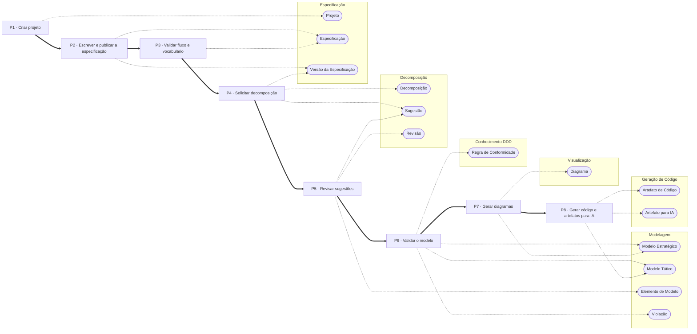

<!-- GERADO por scripts/gerar_docs.py — não edite; edite a fonte e regenere. -->

# Grafo da documentação

Gerado a partir do frontmatter de cada documento (`relacionados`) e das fontes em `docs/modelo/`. Clique num nó para abrir o documento.

## Documentos

```mermaid
flowchart LR
  subgraph aula[aula]
    aula_00_como_usar["Aula 00 — Como usar este guia"]
    aula_01_linguagem_ubiqua_e_fluxo["Aula 01 — Linguagem ubíqua e fluxo"]
    aula_02_subdominios_e_destilacao["Aula 02 — Subdomínios e destilação"]
    aula_03_contextos_delimitados_e_mapa["Aula 03 — Contextos delimitados e mapa de contexto"]
    aula_04_agregados_e_invariantes["Aula 04 — Agregados e invariantes"]
    aula_05_blocos_taticos["Aula 05 — Blocos táticos"]
    aula_06_do_modelo_ao_codigo["Aula 06 — Do modelo ao código"]
    aula_07_artefatos_para_ia["Aula 07 — Artefatos para a IA"]
  end
  subgraph dicionario[dicionario]
    dicionario_ddd["Dicionário de DDD"]
  end
  subgraph glossario[glossario]
    linguagem_ubiqua["Linguagem Ubíqua do DomainStudio"]
  end
  subgraph indice[indice]
    docs_readme["DomainStudio — Documentação"]
    grafo["Grafo da documentação"]
  end
  subgraph modelo[modelo]
    modelo_domain_studio["Modelo de Domínio do DomainStudio"]
  end
  subgraph plano[plano]
    plano_de_implementacao["Plano de Implementação"]
  end
  aula_00_como_usar --- aula_01_linguagem_ubiqua_e_fluxo
  aula_00_como_usar --- dicionario_ddd
  aula_00_como_usar --- docs_readme
  aula_00_como_usar --- grafo
  aula_00_como_usar --- modelo_domain_studio
  aula_01_linguagem_ubiqua_e_fluxo --- aula_02_subdominios_e_destilacao
  aula_01_linguagem_ubiqua_e_fluxo --- aula_07_artefatos_para_ia
  aula_01_linguagem_ubiqua_e_fluxo --- dicionario_ddd
  aula_01_linguagem_ubiqua_e_fluxo --- linguagem_ubiqua
  aula_01_linguagem_ubiqua_e_fluxo --- modelo_domain_studio
  aula_02_subdominios_e_destilacao --- aula_03_contextos_delimitados_e_mapa
  aula_02_subdominios_e_destilacao --- dicionario_ddd
  aula_02_subdominios_e_destilacao --- modelo_domain_studio
  aula_03_contextos_delimitados_e_mapa --- aula_04_agregados_e_invariantes
  aula_03_contextos_delimitados_e_mapa --- aula_07_artefatos_para_ia
  aula_03_contextos_delimitados_e_mapa --- dicionario_ddd
  aula_03_contextos_delimitados_e_mapa --- modelo_domain_studio
  aula_04_agregados_e_invariantes --- aula_05_blocos_taticos
  aula_04_agregados_e_invariantes --- dicionario_ddd
  aula_04_agregados_e_invariantes --- modelo_domain_studio
  aula_05_blocos_taticos --- aula_06_do_modelo_ao_codigo
  aula_05_blocos_taticos --- dicionario_ddd
  aula_05_blocos_taticos --- modelo_domain_studio
  aula_06_do_modelo_ao_codigo --- aula_07_artefatos_para_ia
  aula_06_do_modelo_ao_codigo --- dicionario_ddd
  aula_06_do_modelo_ao_codigo --- modelo_domain_studio
  aula_06_do_modelo_ao_codigo --- plano_de_implementacao
  aula_07_artefatos_para_ia --- grafo
  aula_07_artefatos_para_ia --- linguagem_ubiqua
  aula_07_artefatos_para_ia --- plano_de_implementacao
  dicionario_ddd --- docs_readme
  dicionario_ddd --- modelo_domain_studio
  docs_readme --- grafo
  docs_readme --- modelo_domain_studio
  docs_readme --- plano_de_implementacao
  linguagem_ubiqua --- modelo_domain_studio
  modelo_domain_studio --- plano_de_implementacao
  click docs_readme "README.md"
  click dicionario_ddd "ddd-dicionario.md"
  click grafo "grafo.md"
  click aula_00_como_usar "guia/00-como-usar.md"
  click aula_01_linguagem_ubiqua_e_fluxo "guia/01-linguagem-ubiqua-e-fluxo.md"
  click aula_02_subdominios_e_destilacao "guia/02-subdominios-e-destilacao.md"
  click aula_03_contextos_delimitados_e_mapa "guia/03-contextos-delimitados-e-mapa.md"
  click aula_04_agregados_e_invariantes "guia/04-agregados-e-invariantes.md"
  click aula_05_blocos_taticos "guia/05-blocos-taticos.md"
  click aula_06_do_modelo_ao_codigo "guia/06-do-modelo-ao-codigo.md"
  click aula_07_artefatos_para_ia "guia/07-artefatos-para-ia.md"
  click linguagem_ubiqua "modelo/linguagem-ubiqua.md"
  click modelo_domain_studio "modelo-domain-studio.md"
  click plano_de_implementacao "plano-de-implementacao.md"
```

## Domínio — termos por contexto e o fluxo que os usa

