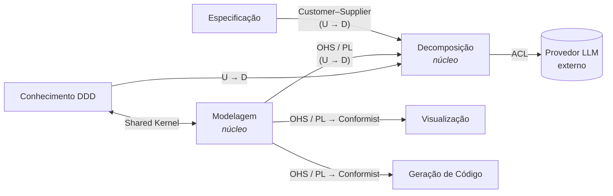

# Modelo de Domínio do DomainStudio (dogfooding)

> O DomainStudio é modelado com o **mesmo método** que ele vai oferecer aos usuários:
> especificação em texto → subdomínios → contextos delimitados → agregados → código.
> Este documento é a especificação de entrada que, no futuro, o próprio sistema
> deverá conseguir decompor e comparar com o resultado abaixo.
>
> Termos seguem o [dicionário de DDD](ddd-dicionario.md).

---

## 1. Especificação (entrada, em linguagem natural)

> Um **usuário** cria um **projeto** e escreve a **especificação** do domínio do seu
> negócio em texto livre. A especificação é **versionada**: cada alteração gera uma
> nova versão, e versões antigas não são modificadas.
>
> A partir de uma versão da especificação, o usuário solicita uma **decomposição**.
> A decomposição, assistida por um modelo de linguagem, produz **sugestões**:
> subdomínios, contextos delimitados, relações entre contextos, agregados,
> entidades, objetos de valor, serviços e eventos. O usuário **revisa** cada
> sugestão (aceita, edita ou rejeita). Só sugestões aceitas entram no modelo.
>
> O **modelo de domínio** do projeto pode também ser editado manualmente. O sistema
> **valida** o modelo contra as regras do DDD (ex.: todo agregado tem exatamente
> uma raiz; referências entre agregados são por identidade; nomes são únicos
> dentro de um contexto) e aponta violações.
>
> A partir do modelo, o sistema gera **diagramas** (Context Map em Context Mapper
> DSL, C4 e diagramas de classe em PlantUML) e, por fim, **código** (esqueleto
> de aplicação por contexto delimitado).

---

## 2. Linguagem Ubíqua

| Termo | Significado no DomainStudio |
|-------|-----------------------------|
| **Projeto** | Espaço de trabalho de um domínio de negócio. Agrupa especificação, modelo e artefatos. |
| **Especificação** | Texto livre que descreve o domínio do negócio. Tem versões imutáveis. |
| **Versão da Especificação** | Retrato imutável do texto num momento. Toda decomposição aponta para uma versão. |
| **Decomposição** | Execução que transforma uma versão da especificação em sugestões de modelo. |
| **Sugestão** | Elemento de modelo proposto pela decomposição, aguardando revisão. |
| **Revisão** | Decisão do usuário sobre uma sugestão: aceitar, editar e aceitar, ou rejeitar. |
| **Modelo Estratégico** | Subdomínios, contextos delimitados e o mapa de contexto de um projeto. |
| **Modelo Tático** | Blocos de construção (agregados, entidades, VOs, serviços, eventos…) de **um** contexto delimitado. |
| **Elemento de Modelo** | Qualquer item de um modelo (um subdomínio, um agregado, um VO…). |
| **Regra de Conformidade** | Regra do DDD verificável automaticamente sobre o modelo. |
| **Violação** | Resultado de uma regra de conformidade não atendida por um elemento. |
| **Diagrama** | Representação textual gerada a partir do modelo (CML, PlantUML, C4). |
| **Artefato de Código** | Arquivo gerado a partir do modelo tático. |

---

## 3. Subdomínios

| Subdomínio | Tipo | Justificativa |
|------------|------|---------------|
| **Decomposição de Domínio** | Núcleo | Transformar texto em modelo DDD coerente é o diferencial do produto. |
| **Modelagem de Domínio** | Núcleo | O modelo validado contra regras DDD é o ativo central; tudo o mais deriva dele. |
| **Especificação** | Suporte | Necessária, mas é essencialmente captura e versionamento de texto. |
| **Visualização** | Suporte | Tradução determinística do modelo para notações existentes. |
| **Geração de Código** | Suporte | Valiosa, mas derivada do modelo; baseada em templates. |
| **Conhecimento DDD** | Suporte | Catálogo de conceitos e regras (o dicionário) consumido pela modelagem e pela decomposição. |
| **Identidade e Acesso** | Genérico | Autenticação/usuários — usar solução pronta. |
| **Modelo de Linguagem (LLM)** | Genérico | Serviço externo; isolado por camada anticorrupção. |

---

## 4. Contextos Delimitados

Cada subdomínio de suporte/núcleo vira um contexto delimitado (1:1 nesta fase).
Identidade e Acesso fica fora do escopo inicial (usuário único).

### 4.1 Especificação
- **Agregado `Projeto`** (raiz: `Projeto`)
  - Atributos: `ProjetoId`, `Nome` (VO), `Descricao`.
- **Agregado `Especificacao`** (raiz: `Especificacao`)
  - Referencia `ProjetoId` (por ID).
  - Contém lista de `VersaoEspecificacao` (VO imutável: número, texto, criada_em).
  - Invariantes: versões são numeradas sequencialmente; versões publicadas nunca mudam.
- **Eventos:** `ProjetoCriado`, `VersaoEspecificacaoPublicada`.
- **Repositórios:** `ProjetoRepository`, `EspecificacaoRepository`.

### 4.2 Decomposição *(núcleo)*
- **Agregado `Decomposicao`** (raiz: `Decomposicao`)
  - Referencia `ProjetoId` e o **número da versão** da especificação.
  - Contém `Sugestao` (entidade interna: tipo de elemento, conteúdo proposto, justificativa, `EstadoRevisao`).
  - `EstadoDecomposicao` (VO): `pendente → em_andamento → concluida | falhou`.
  - Invariantes: só uma decomposição concluída aceita revisões; sugestão revisada não volta a pendente.
- **Serviço de Domínio:** `Decompositor` — porta para o LLM (implementado por adaptador na infraestrutura).
- **Eventos:** `DecomposicaoConcluida`, `SugestaoAceita`, `SugestaoRejeitada`.
- **Política:** *"quando `SugestaoAceita` → aplicar elemento ao Modelo de Domínio"*.

### 4.3 Modelagem *(núcleo)*
- **Agregado `ModeloEstrategico`** (raiz; um por projeto)
  - Contém `Subdominio` (entidade: nome, tipo Core/Supporting/Generic),
    `ContextoDelimitado` (entidade: nome, subdomínio, responsabilidades),
    `RelacaoEntreContextos` (VO: upstream, downstream, padrão — ACL, OHS, Conformist…).
  - Invariantes: nomes únicos; relação não liga um contexto a si mesmo; todo contexto pertence a um subdomínio.
- **Agregado `ModeloTatico`** (raiz; um por contexto delimitado, referenciado por `ContextoId`)
  - Contém `Agregado` (entidade), `ElementoTatico` (entidade: Entidade, VO, Serviço, Evento, Repositório, Fábrica, Política, Especificação).
  - Invariantes: cada agregado tem exatamente uma raiz; cada entidade pertence a um só agregado; referências entre agregados são por identidade.
- **Serviço de Domínio:** `ValidadorDeConformidade` — aplica as `RegraDeConformidade` (padrão *Specification*) e devolve `Violacao`s.
- **Eventos:** `ModeloAlterado`.
- **Interface pública:** *Open Host Service* + *Published Language* (JSON do modelo, versionado).

### 4.4 Visualização
- Sem estado próprio relevante nesta fase: **Serviços de Domínio** geradores
  (`GeradorContextMap` → CML, `GeradorC4` → C4-PlantUML, `GeradorDiagramaClasses` → PlantUML).
- `Diagrama` (VO: tipo, notação, conteúdo textual).
- *Conformist* em relação à Published Language da Modelagem.

### 4.5 Geração de Código
- **Agregado `GeracaoDeCodigo`** (raiz): referencia `ProjetoId`, alvo (`AlvoDeGeracao` VO: ex. `python-fastapi`), lista de `ArtefatoDeCodigo` (VO: caminho, conteúdo).
- **Serviço de Domínio:** `GeradorDeCodigo` baseado em templates por alvo.
- *Conformist* em relação à Published Language da Modelagem.

### 4.6 Conhecimento DDD
- Catálogo somente-leitura: conceitos (o dicionário) e `RegraDeConformidade`s.
- Compartilhado com Modelagem via **Shared Kernel** mínimo: a enumeração dos tipos de
  elemento (`TipoElemento`, `TipoSubdominio`, `PadraoDeIntegracao`).

---

## 5. Mapa de Contexto

| Upstream | Downstream | Padrão | Observação |
|----------|------------|--------|------------|
| Especificação | Decomposição | Customer–Supplier | Decomposição consome versões publicadas. |
| Modelagem | Decomposição | Open Host Service | Decomposição aplica sugestões aceitas via comandos públicos da Modelagem. |
| Modelagem | Visualização | OHS + Published Language → Conformist | Visualização lê o JSON do modelo. |
| Modelagem | Geração de Código | OHS + Published Language → Conformist | Idem. |
| Conhecimento DDD | Modelagem | Shared Kernel | Apenas enumerações de tipos. |
| Conhecimento DDD | Decomposição | Upstream/Downstream | Conceitos usados para montar prompts. |
| Provedor LLM | Decomposição | Anticorruption Layer | O domínio nunca vê o formato do provedor. |

O mesmo mapa em Context Mapper DSL está em [`modelo/domain_studio.cml`](modelo/domain_studio.cml).
